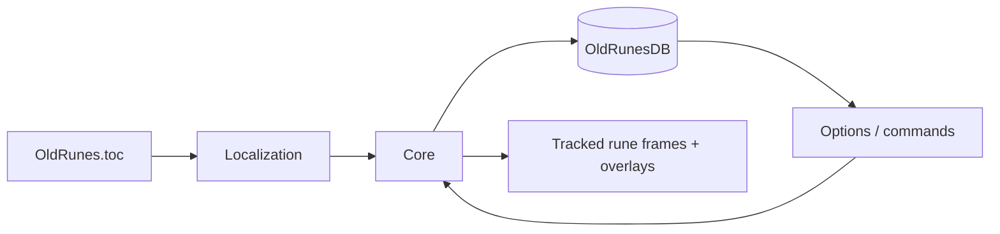

# Code graph

```mermaid
flowchart LR
  TOC["OldRunes.toc"] --> Locale["Localization"]
  Locale --> Core["Core"]
  Core --> DB[("OldRunesDB")]
  Core --> Runes["Tracked rune frames + overlays"]
  DB --> Options["Options / commands"]
  Options --> Core
```
