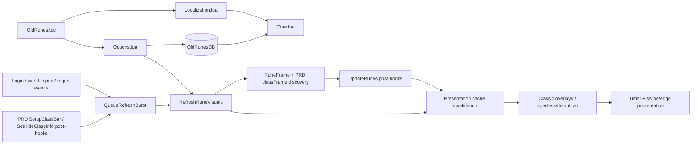

# Code graph

```mermaid
flowchart LR
  TOC["OldRunes.toc"] --> Locale["Localization.lua"]
  Locale --> Core["Core.lua"]
  TOC --> Options["Options.lua"]

  Events["Login / world / spec / regen events"] --> Queue["QueueRefreshBurst"]
  PRD["PRD SetupClassBar / SetHideClassInfo post-hooks"] --> Queue
  Queue --> Refresh["RefreshRuneVisuals"]

  Refresh --> Discover["RuneFrame + PRD classFrame discovery"]
  Discover --> Hooks["UpdateRunes post-hooks"]
  Refresh --> Invalidate["Presentation cache invalidation"]
  Hooks --> Invalidate
  Invalidate --> Render["Classic overlays / specless/default art"]
  Render --> Cooldowns["Timer + swipe/edge presentation"]

  DB[("OldRunesDB")] --> Core
  Options --> DB
  Options --> Refresh
```
