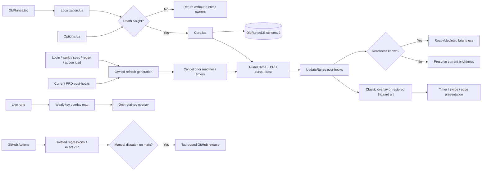

# Code graph

```mermaid
flowchart LR
  TOC[OldRunes.toc] --> Locale[Localization.lua]
  Locale --> Gate{Death Knight?}
  Gate -->|No| Stop[Return without runtime owners]
  Gate -->|Yes| Core[Core.lua]
  Options[Options.lua] --> Gate

  Core --> DB[(OldRunesDB schema 2)]
  Core --> Discover[RuneFrame + PRD classFrame]
  Discover --> Hooks[UpdateRunes post-hooks]
  Hooks --> Ready{Readiness known?}
  Ready -->|Yes| Brightness[Ready/depleted brightness]
  Ready -->|No| Preserve[Preserve current brightness]
  Hooks --> Render[Classic overlay or restored Blizzard art]
  Render --> Cooldown[Timer / swipe / edge presentation]

  Events[Login / world / spec / regen / addon load] --> Generation[Owned refresh generation]
  PRD[Current PRD post-hooks] --> Generation
  Generation --> Cancel[Cancel prior readiness timers]
  Cancel --> Discover

  Rune[Live rune] --> WeakKey[Weak-key overlay map]
  WeakKey --> Overlay[One retained overlay]

  Workflow[GitHub Actions] --> Validate[Isolated regressions + exact ZIP]
  Validate --> MainGate{Manual dispatch on main?}
  MainGate -->|Yes| Release[Tag-bound GitHub release]
```
