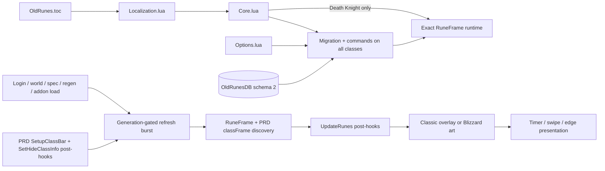

# Code graph

```mermaid
flowchart LR
  TOC[OldRunes.toc] --> Locale[Localization.lua]
  Locale --> Core[Core.lua]
  Core --> Shared[Migration + commands on all classes]
  Core -->|Death Knight only| Runtime[Exact RuneFrame runtime]
  Options[Options.lua] --> Shared

  Events[Login / world / spec / regen / addon load] --> Burst[Generation-gated refresh burst]
  PRD[PRD SetupClassBar + SetHideClassInfo post-hooks] --> Burst
  Burst --> Discover[RuneFrame + PRD classFrame discovery]
  Discover --> Hooks[UpdateRunes post-hooks]
  Hooks --> Render[Classic overlay or Blizzard art]
  Render --> Cooldown[Timer / swipe / edge presentation]

  DB[(OldRunesDB schema 2)] --> Shared
  Shared --> Runtime
```
