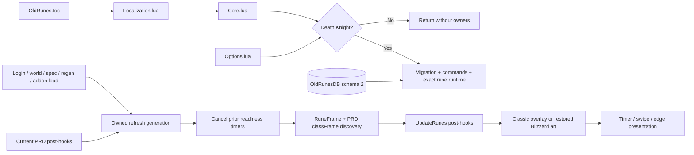

# Code graph

```mermaid
flowchart LR
  TOC[OldRunes.toc] --> Locale[Localization.lua]
  Locale --> Core[Core.lua]
  Core --> Gate{Death Knight?}
  Gate -->|No| Stop[Return without owners]
  Gate -->|Yes| Runtime[Migration + commands + exact rune runtime]
  Options[Options.lua] --> Gate

  Events[Login / world / spec / regen / addon load] --> Burst[Owned refresh generation]
  PRD[Current PRD post-hooks] --> Burst
  Burst --> Cancel[Cancel prior readiness timers]
  Cancel --> Discover[RuneFrame + PRD classFrame discovery]
  Discover --> Hooks[UpdateRunes post-hooks]
  Hooks --> Render[Classic overlay or restored Blizzard art]
  Render --> Cooldown[Timer / swipe / edge presentation]

  DB[(OldRunesDB schema 2)] --> Runtime
```
